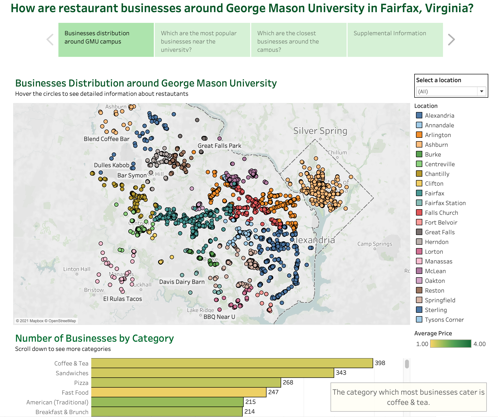

# RESTAURANT BUSINESSES AROUND GEORGE MASON UNIVERSITY IN FAIRFAX, VIRGINIA

### 1. Introduction

The purpose of this project is to build a database and present the business distribution around George Mason University (4400 University Dr, Fairfax, VA 22030). From that, students at GMU can choose their favorite restaurants convenient for them or match with their hobbies.

The project is implemented as following:
- Data collection: retrieve business data using Yelp Fusion API & Google Maps API (Python).
- Relational Database Design (MySQL)
\- Design a conceptual schema using the ER diagram.
\- Translate the ER diagram to relational tables.
\- Create a relational database and populate data into the database.
\- Query the database to perform data analysis.
-  Data visualization: create dashboards (Tableau).

### 2. Data Collection

The dataset contains 3527 businesses located in 24 major cities/towns/CDPs near GMU, including: Fairfax, Vienna, Fairfax Station, Falls Church, Oakton, Centreville, Chantilly, Annandale, Springfield, Reston, McLean, Arlington, Burke, Clifton, Tysons Corner, Herndon, Alexandria, Manassas, Sterling, Great Falls, Ashburn, Washington DC, Lorton, Fort Belvoir.

Data collection is done using Yelp Fusion API and Google Maps API:

-   **Yelp Fusion API** (Business Search & Reviews Endpoints) is used to collect detailed information about businesses, including: business name, address, coordinates, phone, price level, number of reviews and review excerpts.
-   **Google Maps API** (Distance Matrix) is used to get the driving distance (km) and driving travel time (minute) from the GMU campus to a given business.

The raw data returned by Yelp Fusion & Distance Matrix API are saved in the **data** folder.

Please refer to the **GMU_business.ipynb** notebook to see the whole process of data collection, data cleaning & data transformation.

### 3.  **Relational Database Design**

We designed the ER diagram with five entities as following:
- **businesses**: contains all information about businesses.
- **transactions**: contains three types of transactions (pick up, delivery, restaurant_reservation).
- **categories**: contains all types of businesses (coffee & tea, pizza, fast food, ...).
- **reviews**: contains review excerpts from users.
- **users**: contains Yelp user information.

Then, we translated the ER diagram into the relational tables. There are seven tables in the database:
- **businesses** (business_id: string, business_name: string, business_url: string, street: string, city: string, state: string, zip_code: string, phone: string, latitude: number, longitude: number, business_rating: number, is_closed: boolean, price: number, review_count: number, driving_distance: number, driving_duration: number)
- **transactions** (transaction_id: string, transaction_name: string) 
- **categories** (category_id: string, category_name: string)
- **reviews** (review_id: string, review_rating: number, text: string, time_created: date, business_id: references business, user_id: references user)
- **users** (user_id: string, user_name: string, user_profile_url: string, user_image_url: string)
- **transaction_business** (business_id: references business, transaction_id: references transaction) 
- **category_business** (business_id: references business, category_id: references category)

All the information about the relational database design and SQL queries (create databases, create tables, insert records) are stored in the **database_design** folder:
-   **relational_database_design.pdf**: details about ER diagram and the relational tables.
-   **create_database.sql**: queries to create the database and tables.
-   **insert_query** folder: contains queries to populate the data into the database.
-   **data_analysis.sql**: queries that we use to analyze the data.

### 4.  **Data Visualization**
Please access this [link](https://public.tableau.com/app/profile/uyen.huynh4317/viz/GMU_business/Story1) to see the dashboards which visualize the business distribution, the most popular businesses and the closest restaurants around the GMU campus.
